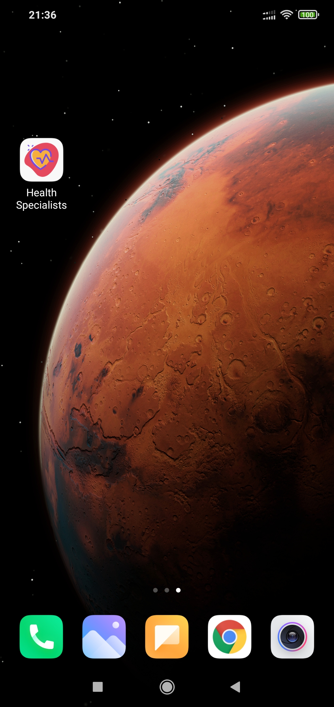

# Desafio Portal Telemedicina
App "Health Specialist" criado para o desafio da oportunidade em React Native.

<p align="center">
  
  
  
</p>


## Prints do App
<p align="center">
  
  <br/>
</p>

## Plataformas Suportadas

- [x] iOS
- [x] Android

#### > React Native 0.64.0


### Tópicos 

:small_blue_diamond: [Descrição do projeto](#descrição-do-projeto)

:small_blue_diamond: [Dependências utilizadas](#dependências-utilizadas-books)

:small_blue_diamond: [Funcionalidades](#funcionalidades)

:small_blue_diamond: [Iniciando com o Projeto](#iniciando-com-o-projeto-zap)


## Descrição do projeto 

<p align="justify">
  App de "Relatório de Compras" criado para o desafio da vaga em React Native na Contele. Contém as funcionalidade listadas a seguir.
</p>


## Dependências utilizadas :books:

- [Styled Components](https://styled-components.com/) Para estilização das telas
- [Async Storage](https://reactnative.dev/docs/asyncstorage) Para armazenamento em banco de dados
- [Vector Icons](https://github.com/oblador/react-native-vector-icons) Para utilização de Icones de forma mais dinâmica
- [Iphone xHelper](https://github.com/ptelad/react-native-iphone-x-helper) Biblioteca para auxiliar no desenvolviemnto para iOS
- [React Navigation](https://reactnavigation.org/) Para uso de rotas e navegação no App

- [React Navigation Bottom Tabs](https://reactnavigation.org/) Para uso de rotas e navegação no App
- [React Native Svg](https://reactnavigation.org/) Para uso de rotas e navegação no App
- [React Native Splash Screen](https://reactnavigation.org/) Para uso de rotas e navegação no App
- [React Native Gesture Handler](https://reactnavigation.org/) Para uso de rotas e navegação no App


## Funcionalidades

:heavy_check_mark: Apresentação/Seja bem vindo 

:heavy_check_mark: Dashboard de Listagem de Especialidades

:heavy_check_mark: Listagem e detalhes de médicos por especialidade escolhida


## Iniciando com o Projeto :zap:

* Clone o projeto. No terminal, digite:

```
git clone 
```

* Após baixar o projeto, instale as dependências rodando o seguinte comando no terminal no diretório do projeto.

```
$ yarn install
```

ou

```
$ npm install
```


## Após instalado as dependências, é hora de executar o App.

* Vamos agora iniciar nosso App. Execute:

### Android 

```
$ yarn android
```

ou

```
$ react-native run-android
```

### iOS

```
$ yarn ios
```

ou

```
$ react-native run-ios
```

* Caso o Metro Server não inicie automaticamente, execute:

```
$ yarn start
```

ou

```
$ npm start
```

* Caso tenha iniciado o Metro Server manualmente após o comando "yarn android" ou "react-native run-android", realize o reload no terminal do Metro Server pressionando "R".
* Caso a tela do emulador permaneça branca, execute "yarn android" ou "react-native run-android" novamente.


## Captura em Uso


## Desenvolvedor(es)/Contribuinte(s) :octocat:

| [<br><sub>Thiago Henrique</sub>](https://github.com/thiagohenrss) |
| :---:
