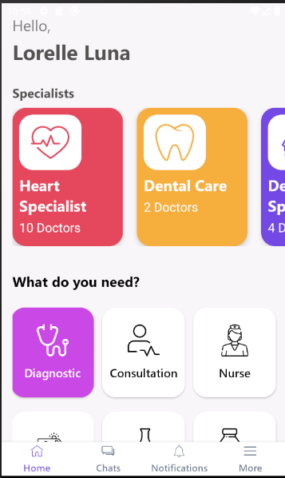
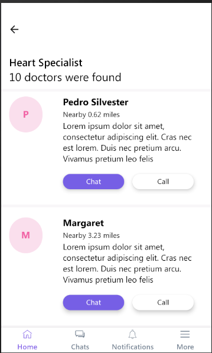

 TelemedicineHealth: ​​application developed in react native for a challenge

  

  

 

  

## Features

- ⚛️ **React Native** —  Mobile framework that provides an efficient way to create native applications for Android and iOS.
    - Use of the styled-components library.
    - Use of the react-navigation library for navigation between screens.
    - Use of axios for communication with api.
    - Use of Redux with Middleware Redux-Sagas.
    - Use of Jest and Testing Library React Native for tests units in app.
    - Use of ⚛️ React Hooks.
    - Use of react-native-animatable for animateds in home app
    - Use of Typescript with React.
    - Use react-native-svg and react-native-svg-transformer for use cache images

    Functional requirements met:

        - use of an organized architecture with redux-saga [x]
        - Unitary tests [x]
        - Image cache [x]
        - Error Handling [x]
        - Design Standard and good [x]
        - Object Orientation practices [x]

       Todo:
        - implement redux-persist: offline function []

        - implement shimer placeholder in second screen []

### Mobile:

Run the lines below to launch the application on your physical device or emulator.

    - yarn install.
    - npx react-native start
    - npx react-native run-android

    - As soon as the process is finished, the application will run on the device that was installed.

    - (if there is an error in the terminal referring to the project libraries, correct by synchronizing the project in android studio).

Run Unit Tests ( coverage tests units in redux-flux - reducers and sagas, and unit test in component CardSpecialist):

    - yarn test

## Licence

This project is licensed under the MIT License - See the [license](https://opensource.org/licenses/MIT) for details.
